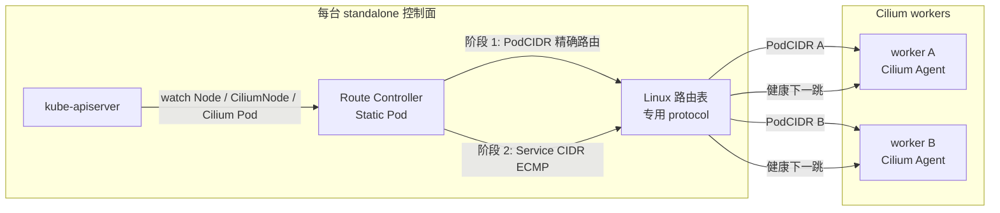

# Route Controller

[](https://github.com/zijiren233/route-controller/actions/workflows/ci.yml)
[](https://github.com/zijiren233/route-controller/actions/workflows/docker.yml)

Route Controller 为不注册 Kubernetes Node 的独立控制面维护到 Cilium 集群网络的
Linux 路由。它以 Static Pod 运行在每台控制面，只修改本机路由；工作节点继续运行
Cilium，承担 PodCIDR 和 Service CIDR 的数据面转发。

该方案适用于控制面与 worker 位于同一可路由内网，且控制面因 standalone Kubelet
没有 CNI 路由的场景。Cilium 可以使用 native routing 或 tunnel 模式。该方案消除了
API Server 到 Pod、Service、webhook 和 worker Kubelet 流量对 Konnectivity 的依赖。

## 架构



控制器从 `CiliumNode.spec.ipam.podCIDRs` 读取真实 PodCIDR。它先为 Node Ready 且
Cilium Pod Ready 的 worker 安装 PodCIDR 路由，再经该路由探测
`CiliumNode.spec.health.ipv4:4240/hello`。探测健康的 worker 共同组成 Service CIDR
的 ECMP 下一跳；默认连续三次失败撤销，一次成功恢复。

Service CIDR 需要路由，因为 ClusterIP 是虚拟地址，外部控制面必须先把报文送到一台
健康的 Cilium worker，由其 eBPF service load-balancing 选择后端。前提是 Cilium
启用外部 ClusterIP 处理。

## 设计边界

- 仅支持 IPv4、Linux 和 netlink。
- 每台控制面独立运行，不启用 leader election。
- 控制器只管理指定 route table、route protocol、Pod CIDR 范围和一个 Service CIDR。
- 目标 CIDR 已存在其他 protocol 的路由时，整轮预检失败，不覆盖 Netplan、BGP 或人工路由。
- PodCIDR 必须位于允许范围内且彼此不重叠；Pod、Service、router 三个总 CIDR 不能重叠。
- CiliumNode InternalIP 必须匹配同名 Node InternalIP，health IP 必须位于该节点 PodCIDR。
- 项目仅声明读取所需的 CiliumNode v2 字段，避免 Cilium 发行模块引入另一套 Kubernetes
  客户端依赖；数据来自稳定的 CRD JSON 接口。
- informer 只 watch `kube-system` 中带 `k8s-app=cilium` 标签的 Pod，并在对象进入缓存前
  分别投影 Node、Pod、CiliumNode；每类资源只保留自身路由规划和缓存一致性所需字段。
  投影降低常驻内存和读取时的 DeepCopy 成本；Kubernetes API 仍会传输并解码完整资源。
- Update 事件只比较投影后的路由字段，忽略 resourceVersion、心跳时间及无关元数据变化。
  Ready、InternalIP、PodCIDR、health IP、Pod 绑定及删除状态变化仍立即入队；创建和删除
  事件始终保留。周期收敛使用 `RequeueAfter`，持续检查外部路由漂移和主动探针，
  不依赖 informer resync。事件过滤不会减少 API watch 流量或阻止缓存更新。
- controller-runtime 缓存完成首次同步前不会执行 reconcile；API 暂时不可用和进程退出时保留路由。
- Kubernetes RBAC 只能把 Pod 权限限制到 `kube-system`；客户端 watch 额外带
  `k8s-app=cilium` label selector，RBAC 本身无法按 label 授权。

## 项目结构

- `cmd/route-controller`：最小进程入口。
- `internal/cli`、`internal/config`：Cobra 命令、Viper 配置和强类型校验。
- `internal/app`：controller-runtime manager 和生产适配器装配。
- `internal/controller`、`internal/planner`：资源 watch、两阶段 reconcile、健康状态机、
  指标和状态接口。
- `internal/route`、`internal/probe`：netlink 和 HTTP 探针适配层。
- `deploy`、`config/examples`：最小 RBAC、Static Pod、安装脚本和示例配置。
- `test/integration`：需要 Linux `NET_ADMIN` 的真实 netlink 生命周期测试。

## Cilium 前提

Route Controller 不依赖特定的 Cilium routing mode。两种模式下都必须允许集群外流量
使用 ClusterIP，具体键名应以正在运行的 Cilium 版本为准：

```yaml
bpf:
  lbExternalClusterIP: true
```

native routing 模式可使用 `autoDirectNodeRoutes` 或底层路由协议维护 worker 间 PodCIDR
路由。VXLAN/Geneve tunnel 模式可以保留现有封装；控制面仍把每个 PodCIDR 发往其所属
worker，跨 worker 的 Service 后端流量再由 Cilium 隧道承载。

worker 必须开启 IPv4 forwarding，并能作为控制面到集群网络的下一跳。上线前确认
worker 防火墙和 Cilium policy 允许控制面访问 PodCIDR、Service CIDR 和 Cilium health
responder 端口，同时验证 Pod 返回控制面时没有被错误 masquerade。

关键内核值应满足：

```text
net.ipv4.ip_forward = 1
net.ipv4.conf.all.rp_filter = 0
net.ipv4.conf.cilium_*.rp_filter = 0
```

Node IP 所在接口的 `rp_filter` 使用 disabled `0` 或 loose mode `2`，不能使用 strict
mode `1`。VXLAN 模式还需要加载 `vxlan` 内核模块，并允许 worker 之间双向 UDP/8473。
部署脚本会通过 Cilium Agent 的主机网络命名空间检查 `ip_forward` 和全局
`rp_filter`，接口级设置仍应纳入节点基线和上线验收。

## CLI

```bash
route-controller run
route-controller validate --config=./config.yaml
route-controller validate --config=./config.yaml --output=yaml
route-controller version --output=json
route-controller completion bash
```

所有运行参数都支持 YAML、环境变量和命令行 flag，优先级为
`flag > environment > YAML > default`。环境变量使用 `ROUTE_CONTROLLER_` 前缀，例如：

```text
ROUTE_CONTROLLER_ROUTES_POD_CIDR
ROUTE_CONTROLLER_PROBE_FAILURE_THRESHOLD
ROUTE_CONTROLLER_OBSERVABILITY_METRICS_BIND_ADDRESS
```

`run` 默认在启动时连接 API Server，并在内存中解析运行配置：

- Pod CIDR：读取 `kube-system/cilium-config` 的 `cluster-pool-ipv4-cidr`，缺失时回退到
  `kube-system/kubeadm-config` 的 `networking.podSubnet`。
- Service CIDR：读取 `kube-system/kubeadm-config` 的 `networking.serviceSubnet`。
- 出口接口：读取所有非控制面 Node 的 IPv4 `InternalIP`，通过本机内核路由逐一解析，
  并要求全部 worker 使用同一接口。
- worker 网段：在出口接口上选择包含所有 worker `InternalIP` 的最具体 IPv4 直连网段。

自动发现不会创建配置文件。`--interface`、`--pod-cidr`、`--service-cidr` 和
`--router-cidr` 可覆盖对应字段；完整覆盖示例见
[config/examples/route-controller.yaml](config/examples/route-controller.yaml)。`validate` 是
离线命令，因此要求配置包含完整路由字段，只校验和规范化配置，不访问 Kubernetes 或
修改路由。

默认可观测端点：

| 地址 | 路径 | 语义 |
| --- | --- | --- |
| `127.0.0.1:9918` | `/metrics` | Prometheus 指标 |
| `127.0.0.1:9918` | `/status` | 最近一次收敛、worker 和期望路由 |
| `127.0.0.1:9919` | `/healthz` | 进程存活 |
| `127.0.0.1:9919` | `/readyz` | 缓存已同步、active 模式已收敛且存在 Service 下一跳 |

## 构建与测试

```bash
make build
make test
make lint-fix
make lint
make build-linux
sudo make integration-test
```

特权集成测试创建临时 dummy interface 和独立路由表，覆盖单下一跳、ECMP、更新、
prune 和外部 protocol 冲突。CI 同时执行 race test、vet、golangci-lint、ShellCheck、
govulncheck、Kubernetes manifest 校验及 linux/amd64、linux/arm64 构建。

容器镜像使用多阶段构建：

```bash
docker build -t route-controller:local .
```

tag 发布通过 GoReleaser 生成 Linux 二进制和 checksum；容器 workflow 参考
`docker/github-builder` 的 reusable workflow，发布多架构镜像、SBOM 和签名。

## Static Pod 部署

先在有管理员 kubeconfig 的控制面创建最小 RBAC 和专用 kubeconfig：

```bash
sudo deploy/scripts/standalone.sh kubeconfig --admin-kubeconfig /path/to/admin.conf
```

standalone Kubelet 不会为 Static Pod 注入 ServiceAccount token。脚本创建显式长期 token
Secret，并生成继承 admin API 地址和 TLS 名称的 kubeconfig；生产环境应限制该文件
权限并建立 token 轮换流程。API Server 证书使用其他 DNS SAN 时，通过
`--tls-server-name` 设置校验名称。

生产镜像清单位于 [deploy/static-pod/image.yaml](deploy/static-pod/image.yaml)。容器
workflow 向 GHCR 发布分支标签和 `sha-<commit>` 标签；清单中的 `main` 仅用于展示，
生产部署必须解析并固定 OCI image index digest：

```bash
ROUTE_CONTROLLER_IMAGE='ghcr.io/zijiren233/route-controller@sha256:<digest>'
kubectl set image --local -f deploy/static-pod/image.yaml \
  controller="${ROUTE_CONTROLLER_IMAGE}" -o yaml > route-controller.yaml
```

把 kubeconfig 放到 `/etc/kubernetes/route-controller/`，再将渲染后的清单原子
安装到 Kubelet static pod manifest 目录。离线环境应把专属镜像及其 digest 同步到
私有仓库。部署不依赖宿主机二进制或 sandbox 镜像。

先检查 `/status` 中的 worker、PodCIDR、Service CIDR 和冲突结果，再逐台控制面切换
`--mode active`。每台就绪后验证 PodIP、ClusterIP、API Server 的 logs、exec、
port-forward 和 Service webhook，再处理下一台。

## Standalone Kubelet 自动部署

统一入口为 `deploy/scripts/standalone.sh`。部署和回滚只修改当前节点文件，使用重启
清空内核中的旧 Cilium/Controller 路由与 BPF 状态，不需要目标节点上的 admin kubeconfig。

| 命令 | 作用 |
| --- | --- |
| `deploy` | 导入 Controller 凭据、预拉镜像、备份文件、停止 kubelet、写入配置 |
| `check` | 重启后检查本机 kubelet、Controller、CRI 和受管路由 |
| `rollback` | 停止 kubelet并恢复部署前文件，不访问 Kubernetes API |
| `kubeconfig` | 导入或复用凭据；也可在管理机器上通过 admin 生成凭据 |

```bash
# 目标节点只需预先生成的 Controller kubeconfig。
IMAGE='ghcr.io/zijiren233/route-controller@sha256:<digest>'
deploy/scripts/standalone.sh deploy --check \
  --kubeconfig /secure/controller.conf --image "$IMAGE"
deploy/scripts/standalone.sh deploy \
  --kubeconfig /secure/controller.conf --image "$IMAGE" --yes --reboot
# 重连节点后：
deploy/scripts/standalone.sh check

# 无 admin、无 API 连接也可恢复本机文件。
deploy/scripts/standalone.sh rollback --check
deploy/scripts/standalone.sh rollback --yes --reboot
# 重连节点后：
deploy/scripts/standalone.sh check
```

以 root 从项目根目录执行，保留相邻部署模板。省略 `--kubeconfig` 时复用
`/etc/kubernetes/route-controller/kubeconfig`，不存在则失败；部署不会生成 RBAC。
导入通过 `kubectl config view --raw --flatten --minify` 内嵌证书，不发起 API 请求。
不支持 exec/auth-provider/tokenFile；目标文件权限为 `0600`。

默认只准备文件并停止 kubelet，需要手动 `systemctl reboot`；`--reboot` 自动请求重启。
不要在准备文件后、重启前重新启动 kubelet。重启清空内核状态，持久化 Cilium/CNI 文件
保留。脚本不调用 cilium-dbg、不更改 Cilium/Helm/sysctl，也不删除 Node、Lease 或 RBAC。
因此保留的 Node 最终会显示 NotReady，部分 Pod API 对象可能陈旧；可由管理员另行处理。
保留 Node 可让回滚沿用原标签、污点；脚本不会重新创建被外部删除的 Node 元数据。

操作前自行迁移业务，配置 Cilium external ClusterIP 和 worker 转发/rp_filter，验证并
处理 EgressSelector/Konnectivity。脚本不再检查集群业务负载或 Cilium DaemonSet 收敛。
逐台重启并保持其余控制面有足够的 API/etcd 可用性；`check` 通过后，验证 PodIP、
ClusterIP、logs、exec、port-forward，再操作下一台。回滚后另行确认 Node/Cilium 恢复。

原始配置 `/var/lib/kubelet/config.yaml` 不变。新增的 standalone 配置、systemd drop-in、
Controller 清单及凭据记录在 `/var/lib/standalone-kubelet-manager/backup` 中；
回滚恢复部署前存在的文件，移除新建文件。重启后的 `check` 是只读操作，使用 boot ID
确认已经重启。中途失败保留备份，使用 `rollback` 恢复。已有部署不会被当作镜像升级。
回滚后保留备份；再次部署需移走旧状态目录或指定新 `--state-dir`。
旧版在线转换产生的备份需先使用旧版脚本回滚，再采用本流程。

在管理机器生成凭据并安全传输到目标节点：
```bash
deploy/scripts/standalone.sh kubeconfig --admin-kubeconfig /secure/admin.conf \
  --output /secure/output/controller.conf --api-server https://api.example.com:6443 \
  --tls-server-name api.example.com --yes
```
仅此生成操作需要 admin 并创建共享 RBAC/token；其自动发现顺序为指定路径、
`KUBECONFIG`、`/etc/kubernetes/admin.conf`、`~/.kube/config`。
详细参数、示例和恢复说明见 `standalone.sh --help`。

## 回滚

移走 Static Pod 清单并等待进程退出。控制器退出时保留路由，确认替代路由已经恢复后，
只清理由本项目 route protocol 持有的路由：

```bash
ip -4 route flush table 254 proto 99
```

不要按目标 CIDR 删除路由，这会误删其他路由组件拥有的条目。
