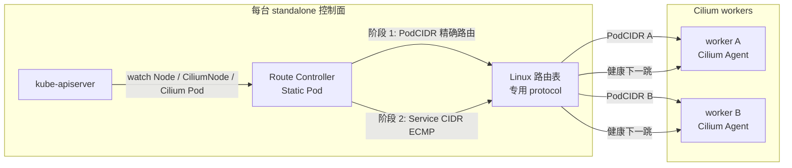

# Route Controller

[](https://github.com/zijiren233/route-controller/actions/workflows/ci.yml)
[](https://github.com/zijiren233/route-controller/actions/workflows/docker.yml)

Route Controller 为不注册 Kubernetes Node 的独立控制面维护到 Cilium 集群网络的
Linux 路由。它以 Static Pod 运行在每台控制面，只修改本机路由；工作节点继续运行
Cilium，承担 PodCIDR 和 Service CIDR 的数据面转发。

该方案适用于控制面与 worker 位于同一可路由内网，且控制面因 standalone Kubelet
没有 CNI 路由的场景。Cilium 可以使用 native routing 或 tunnel 模式。该方案消除了
API Server 到 Pod、Service、webhook 和 worker Kubelet 流量对 Konnectivity 的依赖。

## 架构



控制器从 `CiliumNode.spec.ipam.podCIDRs` 读取真实 PodCIDR。它先为 Node Ready 且
Cilium Pod Ready 的 worker 安装 PodCIDR 路由，再经该路由探测
`CiliumNode.spec.health.ipv4:4240/hello`。探测健康的 worker 共同组成 Service CIDR
的 ECMP 下一跳；默认连续三次失败撤销，一次成功恢复。

Service CIDR 需要路由，因为 ClusterIP 是虚拟地址，外部控制面必须先把报文送到一台
健康的 Cilium worker，由其 eBPF service load-balancing 选择后端。前提是 Cilium
启用外部 ClusterIP 处理。

## 设计边界

- 仅支持 IPv4、Linux 和 netlink。
- 每台控制面独立运行，不启用 leader election。
- 控制器只管理指定 route table、route protocol、Pod CIDR 范围和一个 Service CIDR。
- 目标 CIDR 已存在其他 protocol 的路由时，整轮预检失败，不覆盖 Netplan、BGP 或人工路由。
- PodCIDR 必须位于允许范围内且彼此不重叠；Pod、Service、router 三个总 CIDR 不能重叠。
- CiliumNode InternalIP 必须匹配同名 Node InternalIP，health IP 必须位于该节点 PodCIDR。
- 项目仅声明读取所需的 CiliumNode v2 字段，避免 Cilium 发行模块引入另一套 Kubernetes
  客户端依赖；数据来自稳定的 CRD JSON 接口。
- informer 只 watch `kube-system` 中带 `k8s-app=cilium` 标签的 Pod，并在对象进入缓存前
  分别投影 Node、Pod、CiliumNode；每类资源只保留自身路由规划和缓存一致性所需字段。
  投影降低常驻内存和读取时的 DeepCopy 成本；Kubernetes API 仍会传输并解码完整资源。
- controller-runtime 缓存完成首次同步前不会执行 reconcile；API 暂时不可用和进程退出时保留路由。
- Kubernetes RBAC 只能把 Pod 权限限制到 `kube-system`；客户端 watch 额外带
  `k8s-app=cilium` label selector，RBAC 本身无法按 label 授权。

## 项目结构

- `cmd/route-controller`：最小进程入口。
- `internal/cli`、`internal/config`：Cobra 命令、Viper 配置和强类型校验。
- `internal/app`：controller-runtime manager 和生产适配器装配。
- `internal/controller`、`internal/planner`：资源 watch、两阶段 reconcile、健康状态机、
  指标和状态接口。
- `internal/route`、`internal/probe`：netlink 和 HTTP 探针适配层。
- `deploy`、`config/examples`：最小 RBAC、Static Pod、安装脚本和示例配置。
- `test/integration`：需要 Linux `NET_ADMIN` 的真实 netlink 生命周期测试。

## Cilium 前提

Route Controller 不依赖特定的 Cilium routing mode。两种模式下都必须允许集群外流量
使用 ClusterIP，具体键名应以正在运行的 Cilium 版本为准：

```yaml
bpf:
  lbExternalClusterIP: true
```

native routing 模式可使用 `autoDirectNodeRoutes` 或底层路由协议维护 worker 间 PodCIDR
路由。VXLAN/Geneve tunnel 模式可以保留现有封装；控制面仍把每个 PodCIDR 发往其所属
worker，跨 worker 的 Service 后端流量再由 Cilium 隧道承载。

worker 必须开启 IPv4 forwarding，并能作为控制面到集群网络的下一跳。上线前确认
worker 防火墙和 Cilium policy 允许控制面访问 PodCIDR、Service CIDR 和 Cilium health
responder 端口，同时验证 Pod 返回控制面时没有被错误 masquerade。

## CLI

```bash
route-controller run --config=/etc/route-controller/config.yaml
route-controller validate --config=./config.yaml
route-controller validate --config=./config.yaml --output=yaml
route-controller version --output=json
route-controller completion bash
```

所有运行参数都支持 YAML、环境变量和命令行 flag，优先级为
`flag > environment > YAML > default`。环境变量使用 `ROUTE_CONTROLLER_` 前缀，例如：

```text
ROUTE_CONTROLLER_ROUTES_POD_CIDR
ROUTE_CONTROLLER_PROBE_FAILURE_THRESHOLD
ROUTE_CONTROLLER_OBSERVABILITY_METRICS_BIND_ADDRESS
```

完整配置见 [config/examples/route-controller.yaml](config/examples/route-controller.yaml)。
`pod-cidr`、`service-cidr`、`router-cidr` 必填。`validate` 只校验并规范化配置，不访问
Kubernetes 或修改路由。

默认可观测端点：

| 地址 | 路径 | 语义 |
| --- | --- | --- |
| `127.0.0.1:9918` | `/metrics` | Prometheus 指标 |
| `127.0.0.1:9918` | `/status` | 最近一次收敛、worker 和期望路由 |
| `127.0.0.1:9919` | `/healthz` | 进程存活 |
| `127.0.0.1:9919` | `/readyz` | 缓存已同步、active 模式已收敛且存在 Service 下一跳 |

## 构建与测试

```bash
make build
make test
make lint-fix
make lint
make build-linux
sudo make integration-test
```

特权集成测试创建临时 dummy interface 和独立路由表，覆盖单下一跳、ECMP、更新、
prune 和外部 protocol 冲突。CI 同时执行 race test、vet、golangci-lint、ShellCheck、
govulncheck、Kubernetes manifest 校验及 linux/amd64、linux/arm64 构建。

容器镜像使用多阶段构建：

```bash
docker build -t route-controller:local .
```

tag 发布通过 GoReleaser 生成 Linux 二进制和 checksum；容器 workflow 参考
`docker/github-builder` 的 reusable workflow，发布多架构镜像、SBOM 和签名。

## Static Pod 部署

先在有管理员 kubeconfig 的控制面创建最小 RBAC 和专用 kubeconfig：

```bash
sudo deploy/scripts/bootstrap-kubeconfig.sh
```

standalone Kubelet 不会为 Static Pod 注入 ServiceAccount token。脚本创建显式长期 token
Secret，并生成只连接本机 `https://127.0.0.1:6443` 的 kubeconfig；生产环境应限制该文件
权限并建立 token 轮换流程。API Server 证书使用其他 DNS SAN 时，通过
`ROUTE_CONTROLLER_TLS_SERVER_NAME` 设置校验名称。

生产镜像清单位于 [deploy/static-pod/image.yaml](deploy/static-pod/image.yaml)。容器
workflow 向 GHCR 发布分支标签和 `sha-<commit>` 标签；清单中的 `main` 仅用于展示，
生产部署必须解析并固定 OCI image index digest：

```bash
ROUTE_CONTROLLER_IMAGE='ghcr.io/zijiren233/route-controller@sha256:<digest>'
kubectl set image --local -f deploy/static-pod/image.yaml \
  controller="${ROUTE_CONTROLLER_IMAGE}" -o yaml > route-controller.yaml
```

把配置和 kubeconfig 放到 `/etc/kubernetes/route-controller/`，再将渲染后的清单原子
安装到 Kubelet static pod manifest 目录。离线环境应把专属镜像及其 digest 同步到
私有仓库。部署不依赖宿主机二进制或 sandbox 镜像。

先检查 `/status` 中的 worker、PodCIDR、Service CIDR 和冲突结果，再逐台控制面切换
`--mode active`。每台就绪后验证 PodIP、ClusterIP、API Server 的 logs、exec、
port-forward 和 Service webhook，再处理下一台。

## 回滚

移走 Static Pod 清单并等待进程退出。控制器退出时保留路由，确认替代路由已经恢复后，
只清理由本项目 route protocol 持有的路由：

```bash
ip -4 route flush table 254 proto 99
```

不要按目标 CIDR 删除路由，这会误删其他路由组件拥有的条目。
